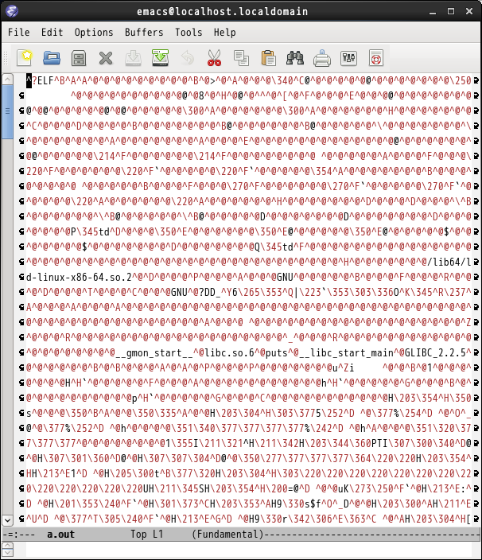

# 実行可能ファイル, バイナリファイル

本題に入る前に，準備としてまず以下の3つの言葉を覚えよう。
* テキストファイル
* バイナリファイル
* 実行可能ファイル（例えば `a.out`）

実行可能ファイルはバイナリファイルの一種だ。

以下の演習をやってみよう。

**◆演習**　下記のC言語プログラムを `hello.c` という名前で保存し，コンパイルして実行してみなさい。

```c
#include <stdio.h>

int main()
{
  printf("hello, world\n");
  return 0;
}
```

以降，シェルプロンプト（`[190999x@wsa-s001:~]$` みたいなやつ）を単に `$` と表記する。`$` の右側が実際に打鍵入力すべきコマンドだ。`--` とその右側は注釈だから入力してはいけない。

```
$ gcc hello.c           -- ファイルa.outが生成される
$ ./a.out               -- a.outを実行
hello, world
```

`hello.c` は **ソースファイル** で `a.out` は **実行可能ファイル** だ。`hello.c` は実行可能ファイルを生成するときには必要だけど，実行するときにはもはや必要ない（後でプログラムを修正したり再利用したりするときのために，削除せずに取っておいた方がよいけどね）。

実行可能ファイルの名前は好きに付けていい。`gcc` の `-o` オプションを使えば出力ファイル名を指定できる。

```
$ gcc hello.c -o hel    -- ファイルhelが生成される
$ ./hel                 -- helを実行
hello, world
```

さて，実行可能ファイルの中身ってどうなっているのだろうか?　中身を覗いてみよう。

**◆演習**　実行可能ファイル `a.out` をEmacsで開いて，中身を見てみなさい。



がーーん。何が起こったの?　一言で言うと，実行可能ファイルは「人間が読み書きすることを目的としていない」，だからテキストエディタでは開けない（あるいは開いてもぐちゃぐちゃな表示になる），てことだ。

Emacsはあきらめて別の方法で中身を見てみよう。

**◆演習**　下記のように，`hexdump -C`コマンドを使って `a.out` の中身を調べなさい。また，`hello.c` の中身も調べなさい。

```
$ hexdump -C a.out
00000000  7f 45 4c 46 02 01 01 00  00 00 00 00 00 00 00 00  |.ELF............|
00000010  02 00 3e 00 01 00 00 00  e0 03 40 00 00 00 00 00  |..>.......@.....|
00000020  40 00 00 00 00 00 00 00  a8 09 00 00 00 00 00 00  |@...............|
00000030  00 00 00 00 40 00 38 00  08 00 40 00 1e 00 1b 00  |....@.8...@.....|
00000040  06 00 00 00 05 00 00 00  40 00 00 00 00 00 00 00  |........@.......|
00000050  40 00 40 00 00 00 00 00  40 00 40 00 00 00 00 00  |@.@.....@.@.....|
-- 中略 (約400行) --
000018d0  6f 5f 68 61 6e 64 6c 65  00 5f 5f 44 54 4f 52 5f  |o_handle.__DTOR_|
000018e0  45 4e 44 5f 5f 00 5f 5f  6c 69 62 63 5f 63 73 75  |END__.__libc_csu|
000018f0  5f 69 6e 69 74 00 5f 5f  62 73 73 5f 73 74 61 72  |_init.__bss_star|
00001900  74 00 5f 65 6e 64 00 5f  65 64 61 74 61 00 6d 61  |t._end._edata.ma|
00001910  69 6e 00 5f 69 6e 69 74  00                       |in._init.|
00001919
$ hexdump -C hello.c
00000000  23 69 6e 63 6c 75 64 65  20 3c 73 74 64 69 6f 2e  |#include <stdio.|
00000010  68 3e 0a 0a 69 6e 74 20  6d 61 69 6e 28 29 0a 7b  |h>..int main().{|
00000020  0a 20 20 70 72 69 6e 74  66 28 22 68 65 6c 6c 6f  |.  printf("hello|
00000030  2c 20 77 6f 72 6c 64 5c  6e 22 29 3b 0a 20 20 72  |, world\n");.  r|
00000040  65 74 75 72 6e 20 30 3b  0a 7d 0a                 |eturn 0;.}.|
0000004b
```

`hexdump` コマンドはファイルの中身を **16進数** の列で表示する。左端の8桁の16進数は，ファイルの先頭から何バイト目かを表している。その次の2桁×16個の16進数がファイルの中身16バイト分だ。その右側は，その16バイトを **文字コード** と解釈したときの文字を示している（対応する文字がない場合は `.` と表示）。

`a.out`の大きさは6,425（16進数では`1919`）バイト，`hello.c`は75（16進数では`4b`）バイトということがわかる。これは下記のコマンドでも確認できる。

```
$ ls -l
合計 12
-rwxrwxr-x. 1 y-takata y-takata 6425  9月  1 18:39 2016 a.out
-rw-rw-r--. 1 y-takata y-takata   75  9月  1 18:38 2016 hello.c
```

## テキストファイルとバイナリファイル

ファイルっていうのは，1バイト (= 8ビット) のデータを好きな長さだけ一列に並べて保存したものだ。8ビットの値は16進数ちょうど2桁で表される（4ビットが16進数1桁に対応）。
`hello.c` のような打鍵入力して作ったファイルは **テキストファイル**
と呼ばれる。上の結果を見るとわかるように，テキストファイルの中身は文字コードの列だ（改行は文字コード 0a で表される）。

* 参考：[文字コード表 ASCII](https://en.wikipedia.org/wiki/ASCII)

一方，`a.out` のようなファイルは **バイナリファイル** と呼ばれる。「打鍵入力や表示が可能な文字だけ」という制限がない，自由なファイルだ。その代わり，そのままでは打鍵入力も表示もできない。なので普通は，人間の手を介さない機械だけが扱うファイルに使われる。例えばディジタルカメラで撮った写真のデータ（JPEG形式）もバイナリファイルだ。


